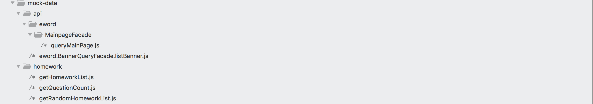

# koa-mocker-cli
> 基于koa框架创建的一个数据mocker服务脚手架工具

## 安装
```bash
npm i -D koa-mocker-cli
```
or
```bash
npm i -g koa-mocker-cli
```

## 使用
```bash
mocker --port=3000 --watch=mock-data/ --gatewayPath=/api --gatewayServiceParamName=serviceName
```

## 选项配置
```
--port 服务器监听的端口
--watch 监听的文件目录path
--gatewayPath 网关代理请求的api路径，默认为'/api'
--gatewayServiceParamName 网关代理请求的服务参数名称，默认为'serviceName'
```

## 示例
### 示例mock文件tree

<br/>

### mock网关数据
> 首先你需要在mock-data(根据命令行配置值)目录下建立api（根据命令行配置值）目录，然后创建你要mock数据的文件

文件1、mock-data/api/eword/MainpageFacade/queryMainPage.js ,
访问localhost:3000/api?serviceName=eword.MainpageFacade.queryMainPage就能看到你mock的数据了
```js
module.exports = {
  "data": {
    "resultObject": {
      "maxLevel": 12,
      "level": 0,
      "percent": 70
    }
  },
  "message": "操作成功",
  "success": true
}
```

文件2、mock-data/api/eword.BannerQueryFacade.listBanner.js ,
访问localhost:3000/api?serviceName=eword.BannerQueryFacade.listBanner就能看到你mock的数据了
```js
// 使用mockjs动态生成内容
const Mock = require('mockjs')

module.exports = {
  "data": Mock.mock({
    "resultList|5": [
      {
        "bannerUrl": "//static.kaike.la/dx/kkl/1812/cf39b2871be3dedef4784a577a1c6a9e88.jpeg"
      }
    ]
  }),
  "message": "操作成功",
  "success": true
}
```


### mock服务controller数据
文件1、mock-data/homework/getHomeworkList.js ,
访问localhost:3000/homework/list就能看到你mock的数据了
```js
module.exports = {
  'GET /homework/list': [
    {
      homeworkId: 1,
      subjectId: 11,
    },
    {
      homeworkId: 2,
      subjectId: 22,
    },
  ]
}
```


文件2、mock-data/homework/getQuestionCount.js ,
访问localhost:3000/homework/count就能看到你mock的数据了
```js
module.exports = {
  'GET /homework/count': 100
}
```

文件3、mock-data/homework/getRandomHomeworkList.js ,
访问localhost:3000/homework/list/random就能看到你mock的数据了
```js
const Mock = require('mockjs')
const subjectNames = ["语文", "数学", "英语", "物理", "化学", "生物", "政治", "历史", "地理", "科学", "其他"];

module.exports = {
  'GET /homework/list/random': function(ctx) {
    const reponseData = Mock.mock({
      "list|20": [
        {
          "homeworkId|+1": 1,
          "subjectId": function() {
              return subjectNames.indexOf(this.subjectName) + 1;
          },
          "subjectName|1": subjectNames,
          "typeName|1": ["视频", "试题"]
        },
      ]
    }).list

    ctx.body = reponseData
  }
}

// // 兼容express框架的写法
// module.exports = {
//   'GET /homework/list/random': function(req, res) {
//     const reponseData = Mock.mock({
//       "list|20": [
//         {
//           "homeworkId|+1": 1,
//           "subjectId": function() {
//               return subjectNames.indexOf(this.subjectName) + 1;
//           },
//           "subjectName|1": subjectNames,
//           "typeName|1": ["视频", "试题"]
//         },
//       ]
//     }).list

//     res.json(reponseData)
//   }
// }
```
